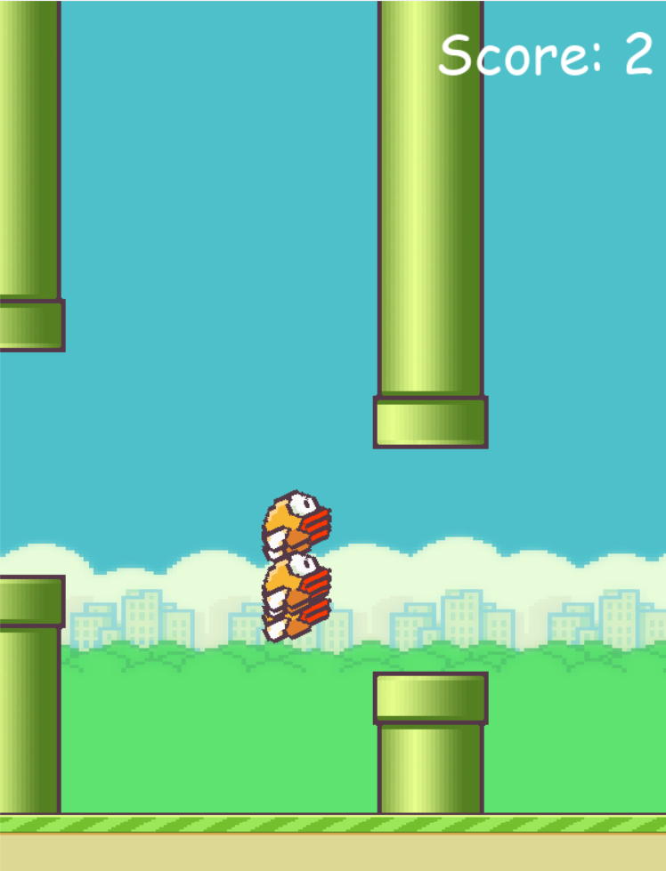

# Flappy Bird Clone

A simple Flappy Bird game developed using Python.

## Introduction
This is a clone of the popular **Flappy Bird** game where you control a bird trying to fly through a series of pipes without hitting them. The bird falls due to gravity and can only gain altitude by flapping (clicking or pressing a key).
You can play the game yourself or observe how does AI learn to play the game

## Features
- **Smooth Gameplay**: Experience smooth, addictive gameplay.
- **Random Pipe Generation**: The pipes are randomly generated, making each game different.
- **Score System**: Players earn points by passing through pipes.
- **Responsive Controls**: The bird can flap by pressing the spacebar or tapping the screen (if applicable).
- **High Score**: Tracks and displays the player's best score.

## Installation
Follow the instructions below to set up the game on your local machine.

### Requirements
- [List programming language or framework requirements, e.g., Python 3.x, Pygame]
  
### Steps
1. Clone this repository:
    ```bash
    git clone https://github.com/Bilal22293/FlappyBird-AI.git
    ```
2. Navigate to the project directory:
    ```bash
    cd FlappyBird-AI
    ```
3. Install dependencies:
    ```bash
    pip install -r requirements.txt
    ```
4. Run the game:
    ```bash
    python flap_mech.py
    ```

## How to Play
- **Objective**: Help the bird fly through gaps between pipes.
- **Controls**: 
  - Press **Space** to make the bird flap its wings and ascend.
  - The bird falls due to gravity, so keep flapping to stay in the air.
- **Scoring**: You gain points for each pipe you pass through.
- **Game Over**: The game ends if the bird hits a pipe or the ground.

## To Run the AI playing Flappy Bird
- **Run**: python flap_ai.py

To change the configuration of model change *config.txt*

The game uses *NEAT* algorithm for learning to play game.

More on *NEAT* - **https://nn.cs.utexas.edu/downloads/papers/stanley.cec02.pdf**


## Screenshots





